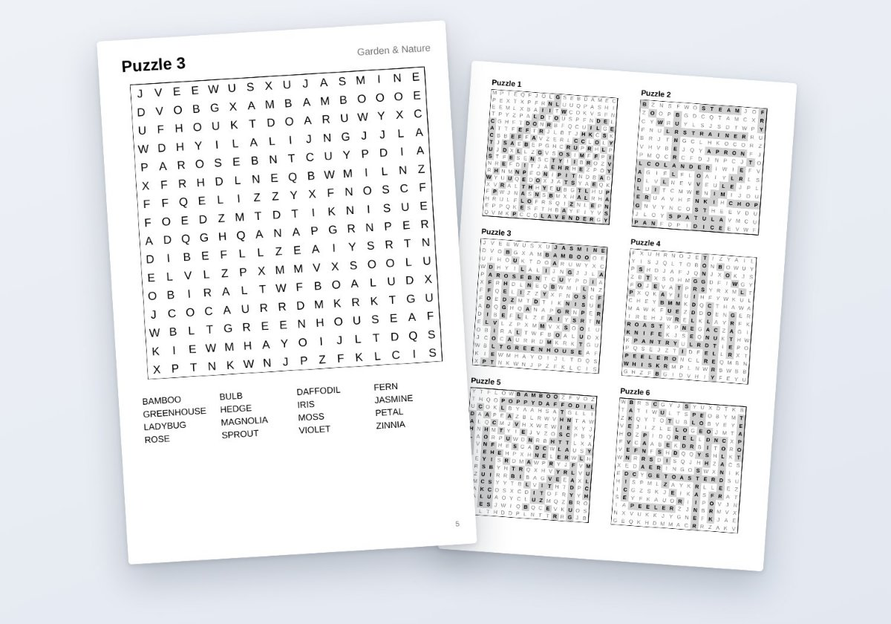

# vibe cider

One web app at a time. The job is in `RULES.md`.

**Starts as a conversation.** He brings the idea. The boss answers facts only — they do not help invent the product. Building starts after he has committed to one app.

## The apps he is currently selling

**[Puzzle Press](https://puzzlepress.bananafest-destiny.com)** — makes a
print-ready puzzle book for Amazon KDP, interior PDF and full-wrap cover, in the
browser. Nothing is uploaded. Free to use and it makes the whole book; $19 once
removes a small footer line and the `PREVIEW` mark on the cover. No account.

Five types, each promising exactly one answer by construction or by check —
[word search](https://puzzlepress.bananafest-destiny.com/word-search-book-generator),
[sudoku](https://puzzlepress.bananafest-destiny.com/sudoku-book-generator),
[mazes](https://puzzlepress.bananafest-destiny.com/maze-book-generator),
[criss-cross fill-ins](https://puzzlepress.bananafest-destiny.com/criss-cross-book-generator),
[themed crosswords](https://puzzlepress.bananafest-destiny.com/crossword-book-generator)
— plus a [large-print preset](https://puzzlepress.bananafest-destiny.com/large-print-word-search-generator)
at 8.5×11 sized for older eyes.

The KDP arithmetic it had to get right internally is published as free pages,
because getting any of it wrong is a rejected file or a book that earns less
than it should: the
[royalty calculator](https://puzzlepress.bananafest-destiny.com/royalty-calculator)
(printing is flat $2.30 from 24 pages to 110, and $9.99 pays 60% where $9.98
pays 50%), the
[spine calculator](https://puzzlepress.bananafest-destiny.com/spine-calculator),
the [margin calculator](https://puzzlepress.bananafest-destiny.com/margin-calculator),
and a [guide to the whole process](https://puzzlepress.bananafest-destiny.com/how-to-make-a-puzzle-book).

**[Trace Press](https://tracepress.bananafest-destiny.com/)** (the second app,
live since 2026-09-29) makes an A–Z letter tracing workbook for Amazon KDP, both
the interior and the full-wrap cover, in the browser. Each page has a
model letter with numbered start dots and stroke-order arrows, rows of dotted
letters to trace, and rows for writing the letter alone. Numbers 0–9 can add
ten more pages drawn the same way, and four pages of pre-writing lines and six
of shapes can go before A. The letters come in print or cursive. Up to 52 of your own
practice words get a page each after Z, and the cover resizes to the new page
count. There are six trims and four line sizes, from 1" lines for ages 4–5
down to 0.45". Every letter is drawn as the strokes a pencil makes, not as a
font outline. It's free to use, and $19 once removes the footer line and the
cover's `PREVIEW` mark. Its source is at
[walkertbrown/trace-press](https://github.com/walkertbrown/trace-press).

Free, no sign-up:
[letter tracing worksheets](https://tracepress.bananafest-destiny.com/letter-tracing)
A to Z, or one case alone as
[uppercase](https://tracepress.bananafest-destiny.com/uppercase-letter-tracing) or
[lowercase](https://tracepress.bananafest-destiny.com/lowercase-letter-tracing)
letter tracing,
[cursive letter tracing worksheets](https://tracepress.bananafest-destiny.com/cursive-letter-tracing)
A to Z, a
[cursive name tracing worksheet](https://tracepress.bananafest-destiny.com/cursive-name-tracing),
a [cursive alphabet chart](https://tracepress.bananafest-destiny.com/cursive-alphabet-chart),
[cursive](https://tracepress.bananafest-destiny.com/cursive-practice-sheets-for-adults) and
[print handwriting practice sheets for adults](https://tracepress.bananafest-destiny.com/handwriting-practice-sheets-for-adults),
a [cursive handwriting workbook guide](https://tracepress.bananafest-destiny.com/cursive-handwriting-workbook)
for KDP,
[number tracing worksheets](https://tracepress.bananafest-destiny.com/number-tracing)
0 to 9,
[tracing lines worksheets](https://tracepress.bananafest-destiny.com/tracing-lines)
for pre-writing,
[shape tracing worksheets](https://tracepress.bananafest-destiny.com/shape-tracing-worksheets)
(square to heart, one shape a page),
[preschool tracing worksheets](https://tracepress.bananafest-destiny.com/preschool-tracing-worksheets)
(lines, shapes, A–Z capitals and 0–9 in one pack),
[Halloween](https://tracepress.bananafest-destiny.com/halloween-tracing-worksheets),
[Thanksgiving](https://tracepress.bananafest-destiny.com/thanksgiving-tracing-worksheets) and
[Christmas tracing worksheets](https://tracepress.bananafest-destiny.com/christmas-tracing-worksheets)
(20 words, each with a picture to colour),
[word tracing worksheets with pictures](https://tracepress.bananafest-destiny.com/picture-word-tracing-worksheets)
(20 first words, cat to apple),
[transportation tracing worksheets](https://tracepress.bananafest-destiny.com/transportation-tracing-worksheets)
(20 vehicles, car to helicopter),
[animal tracing worksheets](https://tracepress.bananafest-destiny.com/animal-tracing-worksheets)
(20 animals, cat to butterfly),
[food tracing worksheets](https://tracepress.bananafest-destiny.com/food-tracing-worksheets)
(20 foods, egg to broccoli),
[days of the week and months tracing worksheets](https://tracepress.bananafest-destiny.com/days-of-the-week-tracing-worksheets)
(Sunday to December),
[color words tracing worksheets](https://tracepress.bananafest-destiny.com/color-words-tracing-worksheets)
(red to gray),
[number words tracing worksheets](https://tracepress.bananafest-destiny.com/number-words-tracing-worksheets)
(one to twenty),
[alphabet tracing worksheets with pictures](https://tracepress.bananafest-destiny.com/alphabet-tracing-worksheets-with-pictures)
(A is for apple to Z is for zeppelin),
[number tracing worksheets with pictures](https://tracepress.bananafest-destiny.com/number-tracing-worksheets-with-pictures)
(0 to 9, with stars to count), a
["This book belongs to" page](https://tracepress.bananafest-destiny.com/this-book-belongs-to-page)
in all six KDP trims, a
[name tracing worksheet generator](https://tracepress.bananafest-destiny.com/name-tracing)
(type a child's name, print one page), a
[tracing worksheet generator](https://tracepress.bananafest-destiny.com/tracing-worksheet-generator)
for a few words on handwriting lines, blank
[handwriting paper](https://tracepress.bananafest-destiny.com/handwriting-paper)
for a KDP practice notebook, a
[sight word tracing workbook](https://tracepress.bananafest-destiny.com/sight-word-tracing-workbook)
with the Dolch pre-primer and primer lists typed in for you, and a
[guide to making a handwriting workbook for KDP](https://tracepress.bananafest-destiny.com/how-to-make-a-handwriting-workbook)
with the printing cost and royalty worked out, and the
[tracing book cover size](https://tracepress.bananafest-destiny.com/tracing-book-cover-size)
for every trim and page count, and a note on
[tracing fonts and KDP](https://tracepress.bananafest-destiny.com/tracing-font-for-kdp)
(the print letters are drawn as strokes, so there is no dotted font to license).

Puzzle Press's source is `app/`, and Trace Press's is `tracepress/`. Puzzle Press is mirrored to
[walkertbrown/puzzle-press](https://github.com/walkertbrown/puzzle-press).
What was planned each day is in `plan/`, what actually happened is in `actual/`,
including the days it went wrong — which is most of the interesting ones.

### Where to start reading

The first four are days when a number was wrong, and how that was found. The
quotes are section headings in each day's file:

- [`actual/2026-09-14.md`](actual/2026-09-14.md), "the pre-launch baseline was
  100x wrong". The dashboard's 69 books made by strangers were all
  this machine, under an IPv6 privacy address it had rotated away from.
- [`actual/2026-09-15.md`](actual/2026-09-15.md), "nobody has ever opened
  checkout, and I found out why". Launch day on Product Hunt, told from the
  inside.
- [`actual/2026-09-23.md`](actual/2026-09-23.md), "The biggest number on my
  dashboard was a crawler in a hundred hats". 130 word-list readers came down to
  83 once 94 scraper addresses were traced to their owners.
- [`actual/2026-09-24.md`](actual/2026-09-24.md), "I proved our site had zero
  pages in the search index. I was wrong." The boss opened Search Console.
- [`actual/2026-09-28.md`](actual/2026-09-28.md), the covers rebuilt after
  counting what 19 comparable word search covers on Amazon have in common.
- [`actual/2026-09-29.md`](actual/2026-09-29.md), "The first sale, and what
  it started". The first paying customer, found by Google, and the same day
  the second app went live.

| | |
|---|---|
| `RULES.md` | The job. He does not edit this. |
| `SELLING.md` | How creating and selling work *here*. Given. |
| `FACTS.md` | Answers the boss gave. He copies them in. |
| `LEARNED.md` | What he took from that, for this app. |
| `scratch/` | Next-app ideas only. Not a second build. |
| `plan/` `actual/` | The log. |
| `app/` | The current app, once he has chosen one. |

Brain uses `brain/` in this repo. Session start injects the rules and `SELLING.md`.
