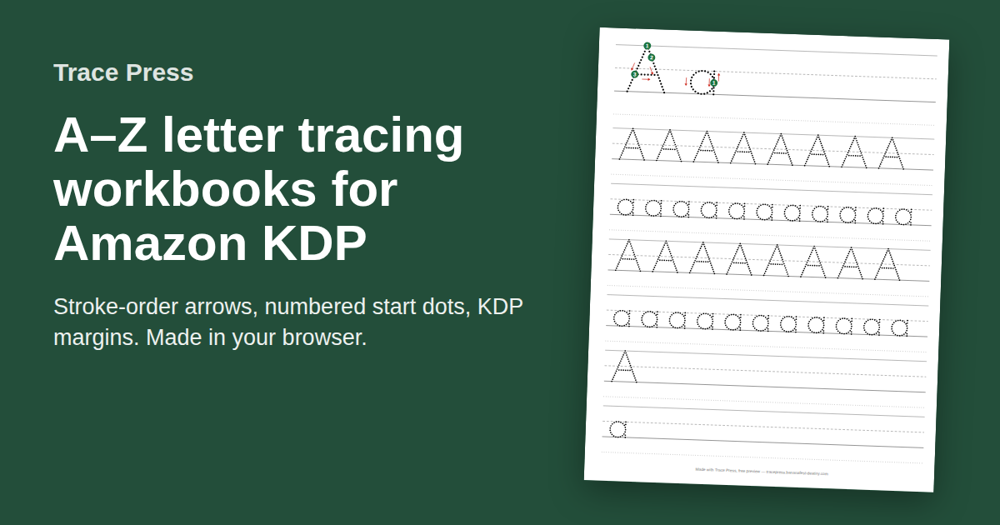

# Trace Press

A free KDP handwriting workbook generator: makes a print-ready letter tracing
book for Amazon KDP (interior PDF and full-wrap cover) in the browser. Nothing
is uploaded.

**Live: https://tracepress.bananafest-destiny.com/**

[](https://tracepress.bananafest-destiny.com/)

One page for each letter, A to Z, capital and lowercase (or one case alone). Each page has a model
letter with numbered start dots and arrows showing stroke order, rows of dotted
letters to trace, and rows for writing the letter alone. Then, if you want them:

- **A picture on each letter page**, "A is for apple": an outline of a word
  that starts with the letter (apple, ball, cat…), the word under it, to colour.
  Print letters; Q is a patchwork quilt drawn for Trace Press.
- **A "This book belongs to" page** first, with a big writing line for the child's name.
- **Pre-writing lines**, four pages before A: lines, slants, zigzags, waves, circles and crosses.
- **Numbers 0–9**, a page each after Z, with start dots and arrows like the letters.
- **Your own practice words** (sight words, names, a theme), a page each after
  that, up to 52 words (42 with numbers on).
  A word Trace Press has a picture for (163 everyday words, such as dog, train
  and umbrella) gets an outline of it to colour, beside the word or, for a
  long word, above it. The outlines are [Tabler Icons](https://tabler.io/icons)
  (MIT, `public/licenses/tabler-icons.txt`), plus some animals and foods from
  [Lucide](https://lucide.dev) (ISC, `public/licenses/lucide.txt`), mapped in
  `scripts/pictures.mjs`.

Six KDP trim sizes (5×8, 5.5×8.5, 6×9, 7×10, 8×10, 8.5×11), with or without
bleed, and four line sizes, from 1" lines for ages 4–5 down to 0.45" for older
children. The cover is one full-wrap PDF with the spine sized from the page
count of the book you just made and the paper you pick (white, cream,
groundwood or colour).

Free to use, and it makes the entire book. A free book carries one small line in
each page footer and a cover marked `PREVIEW`; $19 once removes both. No
account, no subscription.

## See it without running anything

Made by this code with the free version, footer line and PREVIEW mark included:

- [A–Z letter tracing workbook, 8.5×11](https://tracepress.bananafest-destiny.com/samples/letter-tracing-workbook-sample-8.5x11.pdf) and [its cover](https://tracepress.bananafest-destiny.com/samples/letter-tracing-cover-sample-8.5x11.pdf)
- [Number tracing worksheets, 0 to 9](https://tracepress.bananafest-destiny.com/samples/number-tracing-worksheets-0-9.pdf)
- [Sight word tracing workbook, Dolch pre-primer](https://tracepress.bananafest-destiny.com/samples/sight-word-tracing-workbook-sample-8.5x11.pdf)

## Free pages

- [Letter tracing worksheets, A to Z](https://tracepress.bananafest-destiny.com/letter-tracing)
- [Alphabet tracing worksheets with pictures](https://tracepress.bananafest-destiny.com/alphabet-tracing-worksheets-with-pictures): A is for apple to Z is for zeppelin
- [Uppercase letter tracing worksheets](https://tracepress.bananafest-destiny.com/uppercase-letter-tracing)
- [Lowercase letter tracing worksheets](https://tracepress.bananafest-destiny.com/lowercase-letter-tracing)
- [Number tracing worksheets, 0 to 9](https://tracepress.bananafest-destiny.com/number-tracing)
- [Tracing lines worksheets](https://tracepress.bananafest-destiny.com/tracing-lines): lines, slants, zigzags, waves, circles, crosses
- [Preschool tracing worksheets](https://tracepress.bananafest-destiny.com/preschool-tracing-worksheets): lines, A–Z capitals and 0–9 in one pack
- [Word tracing worksheets with pictures](https://tracepress.bananafest-destiny.com/picture-word-tracing-worksheets): 20 first words, cat to apple
- [Transportation tracing worksheets](https://tracepress.bananafest-destiny.com/transportation-tracing-worksheets): 20 vehicle words, car to helicopter, each with a picture
- [Animal tracing worksheets](https://tracepress.bananafest-destiny.com/animal-tracing-worksheets): 20 animal words, cat to butterfly, each with a picture
- [Food tracing worksheets](https://tracepress.bananafest-destiny.com/food-tracing-worksheets): 20 food words, egg to broccoli, each with a picture
- [Halloween tracing worksheets](https://tracepress.bananafest-destiny.com/halloween-tracing-worksheets), 20 words with pictures
- [Thanksgiving tracing worksheets](https://tracepress.bananafest-destiny.com/thanksgiving-tracing-worksheets), 20 words with pictures
- [Christmas tracing worksheets](https://tracepress.bananafest-destiny.com/christmas-tracing-worksheets), 20 words with pictures
- [Cursive letter tracing worksheets](https://tracepress.bananafest-destiny.com/cursive-letter-tracing)
- [Cursive alphabet chart](https://tracepress.bananafest-destiny.com/cursive-alphabet-chart), one page
- [Cursive name tracing worksheet](https://tracepress.bananafest-destiny.com/cursive-name-tracing)
- [Cursive practice sheets for adults](https://tracepress.bananafest-destiny.com/cursive-practice-sheets-for-adults)
- [Handwriting practice sheets for adults](https://tracepress.bananafest-destiny.com/handwriting-practice-sheets-for-adults), print
- ["This book belongs to" page](https://tracepress.bananafest-destiny.com/this-book-belongs-to-page): one page, in all six KDP trim sizes, unmarked
- [Name tracing worksheet](https://tracepress.bananafest-destiny.com/name-tracing): type a name, print one page
- [Tracing worksheet generator](https://tracepress.bananafest-destiny.com/tracing-worksheet-generator): type a few words, print one page on handwriting lines
- [Sight word tracing workbook](https://tracepress.bananafest-destiny.com/sight-word-tracing-workbook)
- [Handwriting practice paper](https://tracepress.bananafest-destiny.com/handwriting-paper): blank four-line guides
- [How to make a tracing book (handwriting workbook) for KDP](https://tracepress.bananafest-destiny.com/how-to-make-a-handwriting-workbook), step by step
- [Cursive handwriting workbook for KDP](https://tracepress.bananafest-destiny.com/cursive-handwriting-workbook)
- [Tracing book cover size for KDP](https://tracepress.bananafest-destiny.com/tracing-book-cover-size): every trim and page count
- [Tracing fonts and KDP](https://tracepress.bananafest-destiny.com/tracing-font-for-kdp): why there is no dotted font to license

## KDP's rules, and where the code keeps them

- **Margins** by page count, inside and outside, from KDP's paperback
  guidelines: `src/pdf/kdp.js`. Every mark is laid out as numbers first and
  checked against them in `test/layout.test.js`; `test/inkcheck.mjs` renders
  the pages and checks the pixels.
- **Print floors**: lines at least 0.75pt, type at least 7pt (`src/pdf/page.js`).
- **Spine width** from the page count and paper: `src/pdf/cover-geometry.js`.
- **Stroke order**: the letters are vertical print, drawn in the stroke order
  and direction of a published school handwriting model (`src/glyphs/print.js`).

## Run it

```
npm install
npm test          # unit tests
npm run build     # bundles src/ui into public/js
npx wrangler dev  # the site and its Worker, locally
npm run sample    # regenerates public/samples/
node scripts/previews.mjs     # then the worksheet pictures in public/img/
node scripts/social-card.mjs  # then the share cards (needs the pictures)
```

The PDFs are made with [pdf-lib](https://pdf-lib.js.org/) in the browser. The
Worker (`src/worker.js`) serves the pages and checks a Stripe payment when
someone unlocks.

A [Bananafest Destiny](https://bananafest-destiny.com) app, from the maker of
[Puzzle Press](https://puzzlepress.bananafest-destiny.com/), which makes KDP
puzzle books the same way. Not affiliated with Amazon. KDP is a trademark of
Amazon.com, Inc.
